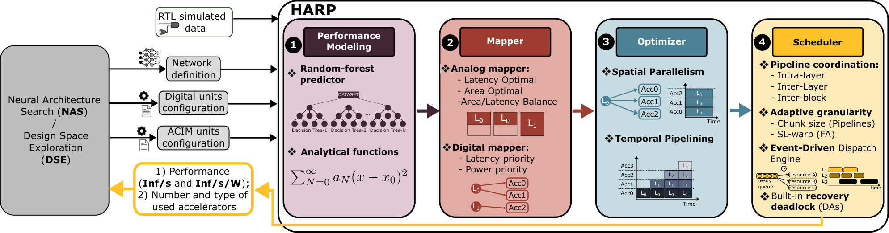

# HARP Framework

[](https://ieeexplore.ieee.org/document/11576587)
[](LICENSE)
[](https://doi.org/10.5281/zenodo.23018118)
[](https://codeocean.com/capsule/4146190/tree)

This repository contains the open-source code for **"HARP: Heterogeneous Analog-Digital Resource-Aware Performance and Scheduling Framework for Transformer Acceleration"**, published in *IEEE Transactions on Parallel and Distributed Systems* (TPDS), Volume 37, Issue 9, September 2026. See the [paper](https://ieeexplore.ieee.org/document/11576587) for the full methodology and evaluation.

HARP schedules Transformer inference on a heterogeneous platform that combines **Analog Compute-in-Memory (ACIM)** tiles with **Programmable Multi-Core Accelerators (PMCA)**.  
It performs analog mapping, instantiates accelerators, assigns digital work, and schedules the full hybrid system with **intra-layer pipelining/parallelism**, **inter-layer** and **inter-block** pipelines, **chunk optimization**, and **FlashAttention** options.



HARP takes a network definition together with ACIM and digital unit configurations, and returns
performance (Inf/s, Inf/s/W) plus the number and type of accelerators used -- a loop that can be
driven by an outer Neural Architecture Search / Design Space Exploration. Internally it runs four stages:

| Stage | What it does | Where in the repo |
|-------|--------------|-------------------|
| **1. Performance Modeling** | Random-forest predictors (fitted on RTL-simulated data) and analytical cost functions | `pmca_prediction_model/`, `nodes/cost_models.py`, `AnalogMapping.py` |
| **2. Mapper** | Analog mapping (latency / area / area-latency-balance optimal) and digital mapping (latency- or power-priority) | `scheduler/analog_scheduler.py`, `scheduler.optimize_mapping()`, `AnalogMapping.py` |
| **3. Optimizer** | Spatial parallelism and temporal pipelining | `utils/layer_splitter_utils.py`, `scheduler/scheduler.py` |
| **4. Scheduler** | Pipeline coordination (intra-layer / inter-layer / inter-block), adaptive granularity (chunk size, SL-warp), event-driven dispatch with deadlock recovery | `scheduler/scheduler.py` |

## Contents
1. [Repository layout](#1-repository-layout)
2. [Installation](#2-installation)
3. [Contributing](#3-contributing)
4. [Quick start](#4-quick-start)
   - [4.1 Baseline runs](#41-baseline-runs)
   - [4.2 Autoregressive decoding](#42-autoregressive-decoding)
5. [Outputs](#5-outputs)
   - [5.1 Cleaning up](#51-cleaning-up)
6. [Hardware configuration](#6-hardware-configuration)
7. [Reproducing the paper's configurations](#7-reproducing-the-papers-configurations) -- **reproducing the paper's results starts here; see also [ARTIFACT.md](ARTIFACT.md), the full reproducibility artifact**
   - [7.1 Regression checks](#71-regression-checks)
   - [7.2 Reproducing the paper's figures](#72-reproducing-the-papers-figures)
8. [Sweeps with `runner.py`](#8-sweeps-with-runnerpy)
9. [CLI reference](#9-cli-reference)
10. [Citation](#10-citation)
11. [License](#11-license)

## 1. Repository layout
- `models/` -- Transformer model generators (encoders: MobileBERT, BERT_B, BERT_L, ALBERT_B, T5_encoder; decoders: NanoGPT, GPT2_small, T5_decoder; plus `dumpLayer` for single-layer experiments and `dumpModel` for a small 2-block/6-FC-layer illustrative model)
- `nodes/` -- Hardware configs & cost-models
  - `accelerator_config.py` -- ACIM/PMCA/SRAM/DDR/LINK platform parameters
- `pmca_prediction_model/` -- learned predictors for PMCA latency
- `scheduler/` -- Analog & hybrid scheduling logic
- `utils/` -- CLI flags and common helpers
  - `config.py` -- argparse definitions
  - `plots.py` -- plot helpers
  - `clean_outputs.py` -- deletes generated run artifacts from `outputs/` and `Plots/`
- `regression_checks/` -- TABLE III architecture tooling, regression checks, and paper-figure reproduction
  - `set_model_arch.py` -- applies/checks a model's TABLE III row in `nodes/accelerator_config.py`
  - `check_models_regression.py` -- latency regression check across models & pipeline configs
  - `reproduce_figure.py` -- regenerates the paper's evaluation figures (Figs. 6-13)
- `AnalogMapping.py` -- auxiliary/legacy analog mapping utilities
- `main.py` -- entry point
- `runner.py` -- batch sweep runner that parses stdout metrics
- `README.md`
- `ARTIFACT.md` -- reproducibility artifact description (TPDS artifact evaluation)

---

## 2. Installation
Requires **Python 3.10+**.
###### Create local Python environment
```bash
python3 -m venv harp
source harp/bin/activate      # Windows: harp\Scripts\activate
pip install -r requirements.txt
```
> `scikit-learn` is pinned to `1.6.1` because the PMCA latency predictors in
> `pmca_prediction_model/*.pkl` were serialized with that version. Newer releases
> still load them but emit `InconsistentVersionWarning`.

## 3. Contributing
Pull requests are welcome. Commits must include a `Signed-off-by` line (the
[DCO](https://github.com/probot/dco) bot enforces this on every PR) -- add it
automatically with `git commit -s`.

## 4. Quick start
### 4.1 Baseline runs
main.py arguments are defined in `utils/config.py`; default values are shown in the [CLI reference](#9-cli-reference) section below.

```bash
# Intra-layer parallelism (digital splits), no pipelines
python3 main.py --model MobileBERT --parall_type intra_layer --pipe_type none

# Intra-layer pipelining (attention chunking)
python3 main.py --model MobileBERT --parall_type intra_layer --pipe_type intra_layer --chunk_size_d 16

# Inter-layer pipeline (XL-Pipe-style)
python3 main.py --model MobileBERT --parall_type intra_layer --pipe_type inter_layer --chunk_size_d 32

# Inter-block pipeline (default in config.py)
python3 main.py --model MobileBERT --parall_type intra_layer --pipe_type inter_block --chunk_size_d 8

# Inter-layer pipeline + chunk optimization (search for best chunk)
python3 main.py --model MobileBERT --parall_type intra_layer --pipe_type inter_block --chunk_opt true

# FlashAttention (explicit warp)
python3 main.py --model BERT_B --pipe_type intra_layer --flash_attention true --sl_warp 64

# FlashAttention (auto-tune warp size)
python3 main.py --model BERT_B --pipe_type intra_layer --flash_attention true --auto_tune_sl_warp true
```

### 4.2 Autoregressive decoding
Decoder models (`NanoGPT`, `GPT2_small`, `T5_decoder`) can be run in autoregressive mode.
`--prefill_size` sets the prompt length; the model then generates token by token, so
`--chunk_size_d` must be `1` and `--chunk_opt` must stay `False`.

```bash
# GPT-2 small, 512-token prefill
python3 main.py --model GPT2_small --autoregressive true \
  --prefill_size 512 --chunk_size_d 1 --flash_attention true

# T5 decoder (cross-attention against the encoder sequence)
python3 main.py --model T5_decoder --autoregressive true \
  --sl 1 --chunk_size_d 1 --prefill_size 0
```
> **T5 decoder -- why `--prefill_size 0`.** For T5 the encoder context length is
> fixed by the hardcoded `SL_cross=512` in `main.py`, so it is *not* set through
> `--prefill_size`; that flag sizes the decoder's own KV cache instead. Because
> `main.py` adds `SL` to the value, `--prefill_size 0` gives an **effective
> prefill of 1** -- the first decode step, where the encoder K/V projections are
> charged in full. Any effective prefill `> 1` takes the amortized path in
> `scheduler/analog_scheduler.py`, where those projections are treated as
> pre-computed and cost nothing.
> Autoregressive KV state grows with the prefill, so these runs can exceed the digital
> accelerators' memory and report `Total latency: inf`. If that happens, enable
> `--flash_attention true` (as above).


## 5. Outputs
`main.py` creates (if missing) and writes into:
```text
outputs/
  |-- Summary/              # run_summary_<suffix>.txt (text summary)
  |-- Scheduling/           # schedule_detailed_<suffix>.log (timeline)
  |-- Attention/            # attention timing details
  `-- AnalogLayerMapping/   # analog mapping summaries
Plots/
  |-- AnalogMapping/        # analog tile/tier mapping figure (needs --display_plots true)
  |-- Attention/            # flash-attention tuning/scheduling/memory plots (needs --display_plots true)
  |-- Scheduling/           # schedule timeline (needs --display_plots true)
  |-- Breakdown/            # energy/latency share by accelerator class -- written every run, regardless of --display_plots
  |-- Model_graphs/         # <model>_graph.html -- simplified DAG view of the model, written every run
  `-- <model>_chunk_latency_tuning_*.pdf   # chunk-size sweep, written loose in Plots/ (needs --chunk_opt true and --display_plots true)
```
During execution, the following metrics are reported to the console:
```text
=== Total latency: <ms> ms ===

Analog energy: <mJ>
Digital Accelerators energy: <mJ>
Total energy: <mJ>
Total avg power: <W>
Total area: <mm^2>
----------------------------------------------------------------------
Total ACIM tiles used for single tier: <N> / <cap>
Total ACIM tiles used: <N> / <cap>
Total PMCA_RED used: <N> / <cap>
Total PMCA used: <N> / <cap>
Total DA used: <N> / <cap>
Total SRAM usage: <MiB>. SRAM tiles (of SRAM_TILE_CONFIG['size'] MiB) required: <N>
TDP: <W>
----------------------------------------------------------------------
Throughput: <Inf/s>
Energy efficiency: <Inf/s/W>
----------------------------------------------------------------------
=== Execution time: <s> seconds ===
```
For accurate runtime, set **--display_plots** false.

### 5.1 Cleaning up
`utils/clean_outputs.py` removes the run artifacts written above, keeping the
directory structure in place. Run it from the repo root. By default it only
clears `outputs/`, since `Plots/` usually holds figures we want to keep.

```bash
python3 utils/clean_outputs.py                  # clear outputs/
python3 utils/clean_outputs.py --plots          # also clear Plots/
python3 utils/clean_outputs.py --all            # same as --plots
python3 utils/clean_outputs.py --dry-run        # show what would go, delete nothing
python3 utils/clean_outputs.py --older-than 7   # only files untouched for 7+ days
python3 utils/clean_outputs.py --model BERT_L   # only files whose name mentions BERT_L
```

---
## 6. Hardware configuration

Per-unit physical parameters, from `nodes/accelerator_config.py`. These are the
properties of a *single* tile/node; **how many of each** a given model uses is set
per-model -- see [Reproducing the paper's configurations](#7-reproducing-the-papers-configurations)
below, which is the single source of truth for sizing.

Platform-wide: `clock_frequency = 2 ns`, `NUM_CHIPS = 1`.

#### ACIM tiles
- `tile_rows = 512`, `tile_cols = 512`, `num_tiers = 8`, `precision = 8`
- `integration_time = 350 ns` (0.00035 ms)
- PPU: `ppu_lat_initial = 3` cycles, `n_ppus = 8`, `power_ppu = 0.07 x 50% / 8`
  (the 8 PPUs together add 50% on top of the tile power)
- Power ~ **0.07 W** per tile
- Area ~ **1.5 $mm^2$**

#### PMCA tiles
- `num_cores = 8`, `MACE = no`, `fp_precision = 16`, `tcdm_capacity = 128 KB`
- `dma_bandwidth = 8 B/cycle`
- Power ~ **0.192 W**
- Area ~ **1.7 $mm^2$**

#### PMCA+MACE tiles
- `num_cores = 8`, `MACE = yes`, `fp_precision = 16`, `tcdm_capacity = 128 KB`
- `dma_bandwidth = 8 B/cycle`
- Power ~ **0.258 W**
- Area ~ **1.92 $mm^2$**

#### DA0 / SFU tiles
- `num_cores = 4`, `max_parallel = 64` per core, `const_delay = 0` cycles
- `fp_precision = 10`, `tcdm_capacity = 1000 KB`, `dma_bandwidth = 160 B/cycle`
- Power ~ **0.16 W** (plus 5.5e-6 W idle)
- Area ~ **0.8047 $mm^2$**

#### SRAM / DDR / LINK
- **SRAM:** `size = 1 MiB` per tile, `bandwidth = 64 MiB/s`, power ~ **0.00545 W**, area ~ **1.25 $mm^2$**
- **DDR:** `bandwidth = 800 MiB/s`, power ~ **2.5 W**, area ~ **1 $mm^2$**
- **LINK:** `bandwidth = 512 b/cycle`, `num_links = 1`, power ~ **0.013 W**, area **0**

---
## 7. Reproducing the paper's configurations

The per-model platform sizings in **TABLE III** of the HARP paper are encoded in
`regression_checks/set_model_arch.py`, which rewrites `nodes/accelerator_config.py`
in place. `main.py` does no per-model switching of its own -- it reads whatever is
currently in the config file -- so apply the architecture *before* running:

```bash
python3 regression_checks/set_model_arch.py --list           # print TABLE III
python3 regression_checks/set_model_arch.py --model BERT_B   # apply a row
python3 main.py --model BERT_B --sl 128 --chunk_size_d 8 --parall_type intra_layer --pipe_type inter_block
```

| Model | #ACIM tiles | #PMCA+MACE | #PMCA | SRAM (MiB) | Link (b/cycle) | DDR (MiB/s) |
|-------|------------:|-----------:|------:|-----------:|---------------:|------------:|
| `MobileBERT` | 16 | 4 | 0 | 1 | 512 | 800 |
| `BERT_B` | 96 | 12 | 20 | 8 | 512 | 800 |
| `BERT_L` | 144 | 12 | 20 | 12 | 512 | 800 |
| `GPT2_small` | 96 | 12 | 20 | 8 | 512 | 800 |
| `T5_encoder` / `T5_decoder` | 96 | 12 | 20 | 8 | 512 | 800 |

Each ACIM tile has 8 tiers. `SRAM_TILE_CONFIG["size"]` stays fixed at 1 MiB/tile,
so "SRAM size (MiB)" maps onto `SRAM_TILE_CONFIG["num_tiles"]`.

To check whether `nodes/accelerator_config.py` already matches a TABLE III row, without overwriting it:
```bash
python3 regression_checks/set_model_arch.py --model BERT_B --check   # exits 1 on mismatch
python3 regression_checks/set_model_arch.py --check-all              # which row does it match?
```

### 7.1 Regression checks
`regression_checks/check_models_regression.py` applies each model's TABLE III
architecture, runs it across the six parallelism/pipelining configurations, and
compares **Total latency** against known-good reference values. Throughput and
energy are reported but not asserted.

```bash
python3 regression_checks/check_models_regression.py                      # all suites
python3 regression_checks/check_models_regression.py --list               # show suites
python3 regression_checks/check_models_regression.py --models BERT_B      # one model
python3 regression_checks/check_models_regression.py --models BERT_B --configs Serial,XB-pipe
python3 regression_checks/check_models_regression.py --models BERT_B --record   # regenerate references
```

The six configurations match the labels used in the paper:

| Label | `--parall_type` | `--pipe_type` |
|-------|-----------------|---------------|
| `Serial` | `none` | `none` |
| `IL-Par` | `intra_layer` | `none` |
| `IL-Pipe` | `intra_layer` | `intra_layer` |
| `XL-Pipe` | `intra_layer` | `inter_layer` |
| `IL+XL-Pipe` | `intra_layer` | `inter_intra_layer` |
| `XB-pipe` | `intra_layer` | `inter_block` |

> The checker rewrites `nodes/accelerator_config.py` as it runs and restores the
> original contents on exit; pass `--keep-arch` to leave the last-applied
> architecture in place.

### 7.2 Reproducing the paper's figures
`regression_checks/reproduce_figure.py` regenerates the paper's evaluation figures
(Figs. 6-13) directly -- applying the right TABLE III architecture, running the
figure's swept configuration, and saving a PNG laid out panel-for-panel like the
published figure. Results are cached per figure, so a plot can be redrawn from
already-computed numbers in seconds via `--replot`, without re-simulating.

```bash
python3 regression_checks/reproduce_figure.py --list                  # show all available figures
python3 regression_checks/reproduce_figure.py --figure 7              # run + plot one figure
python3 regression_checks/reproduce_figure.py --figure 10 --replot    # redraw from cached results
```

See **[ARTIFACT.md](ARTIFACT.md)** for the full reproducibility workflow: the
figure &rarr; paper mapping, measured per-figure runtimes (a from-scratch run of
every figure is ~84h, dominated by Fig. 10's chunk-size search), the recommended
reviewer path, and the same `nodes/accelerator_config.py` concurrency warning as
the regression checker above.

---
## 8. Sweeps with `runner.py`
`runner.py` executes a grid of configs and saves a CSV with parsed metrics.

```bash
# runner.py hardcodes the interpreter path (`/opt/conda/envs/sda/bin/python`) --
# edit it if your environment lives elsewhere:
# cmd = ["/opt/conda/envs/sda/bin/python", "main.py", "--model", model]
python3 runner.py
```

It writes `outputs/Sweeps/run_metrics_<models>_SL<sl><timestamp>.csv` with the following columns:

| Column              | Description                        |
|---------------------|------------------------------------|
| `timestamp`         | Time of run                        |
| `cmd`               | Full command executed              |
| `total_latency_ms`  | Total latency in ms                |
| `analog_energy_mJ`  | Analog energy in mJ                |
| `digital_energy_mJ` | Digital energy in mJ               |
| `total_energy_mJ`   | Total energy in mJ                 |
| `avg_power_W`       | Average power in W                 |
| `area_mm2`          | Total area in mm^2                  |
| `TDP_W`             | TDP in W                           |
| `throughput_inf_s`  | Throughput in inferences/sec       |
| `energy_eff_inf_s_W`| Energy efficiency (Inf/s/W)        |
| `execution_time_s`  | Execution time in seconds          |
| `model`             | Model name (MobileBERT, etc.)      |
| `parall_type`       | Parallelism type                   |
| `pipe_type`         | Pipelining type                    |
| `chunk_size_d`      | Chunk size (if provided)           |
| `chunk_opt`         | Whether chunk optimization enabled |
| `sl`                | Sequence length used for the run   |
| `autoregressive`    | Whether autoregressive mode was on |
| `prefill_size`      | Prefill size used for the run      |

## 9. CLI reference

Arguments from `utils/config.py`:

| Flag | Choices / Type | Default | Description |
|------|----------------|---------|-------------|
| `--model` | `MobileBERT` \| `BERT_B` \| `BERT_L` \| `ALBERT_B` \| `NanoGPT` \| `GPT2_small` \| `T5_encoder` \| `T5_decoder` \| `dumpLayer` | `MobileBERT` | Model preset |
| `--dumplayer_size` | `128` \| `512` \| `1024` \| `2048` \| `4096` \| `8192` | `128` | Row/col size of the single layer; only used when `--model dumpLayer` |
| `--sl` | int | `1` | Sequence length |
| `--autoregressive` | bool (`true`/`false`) | `false` | Autoregressive decoding (decoder models only) |
| `--prefill_size` | int | `512` | Prefill size; only used for autoregressive models |
| `--opt_level` | `latency` \| `area` \| `power` \| `area_latency_balance` | `latency` | Analog optimization objective |
| `--parall_type` | `none` \| `intra_layer` | `none` | Parallelism strategy |
| `--pipe_type` | `none` \| `intra_layer` \| `inter_layer` \| `inter_intra_layer` \| `inter_block` | `none` | Pipelining strategy |
| `--flash_attention` | bool (`true`/`false`) | `false` | Enable FlashAttention |
| `--sl_warp` | int or `none` | `64` | Sequence-length warp size (FlashAttention) |
| `--auto_tune_sl_warp` | bool | `false` | Auto-tune `sl_warp` (requires FlashAttention) |
| `--chunk_opt` | bool | `false` | Enable chunk-size auto-optimization |
| `--chunk_size_d` | int | `8` | Chunk size for attention/dataflow |
| `--use_transfer_link` | bool | `true` | Enable/disable transfer link model |
| `--display_plots` | bool | `false` | Show plots (disable for precise timing) |
| `--digital_opt` | `latency` \| `power` | `latency` | Digital optimization objective |


---
## 10. Citation
If you use HARP in your research, please cite:

> E. Ferro, H. Benmeziane and I. Boybat, "HARP: Heterogeneous Analog-Digital Resource-Aware
> Performance and Scheduling Framework for Transformer Acceleration," *IEEE Transactions on
> Parallel and Distributed Systems*, vol. 37, no. 9, pp. 2107-2121, 2026,
> doi: [10.1109/TPDS.2026.3706975](https://doi.org/10.1109/TPDS.2026.3706975).

```bibtex
@ARTICLE{HARP_TPDS2026,
  author={Ferro, Elena and Benmeziane, Hadjer and Boybat, Irem},
  journal={IEEE Transactions on Parallel and Distributed Systems},
  title={HARP: Heterogeneous Analog-Digital Resource-Aware Performance and Scheduling Framework for Transformer Acceleration},
  year={2026},
  volume={37},
  number={9},
  pages={2107-2121},
  doi={10.1109/TPDS.2026.3706975}}
```

---
## 11. License

This project is licensed under the Apache License 2.0 -- see [LICENSE](LICENSE) for the full text.